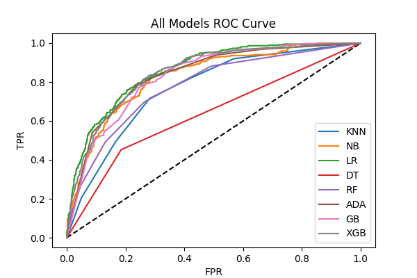

# 🤖 AI-Powered Customer Retention Prediction System

> An end-to-end Machine Learning pipeline that predicts customer churn and deploys predictions via a real-time Flask web application.


---

## 📌 Overview

Customer churn is one of the biggest challenges for subscription-based businesses. This project builds a **complete ML pipeline** — from raw data ingestion to a deployed web application — that predicts whether a telecom customer is likely to churn, enabling businesses to take proactive retention action.

The system uses the **IBM Telco Customer Churn dataset** (~7,000 customers) and benchmarks **8 classification algorithms**, selecting the best model based on AUC-ROC score for final deployment.

---

## 🚀 Live Demo

Enter customer details into the web app and get an instant prediction:

- ✅ **Customer will Stay**
- ❌ **Customer will Churn**

---

## 🏗️ Project Architecture

```
Raw CSV Data
    ↓
Data Preprocessing     ← missing_data.py
    ↓
Outlier Treatment      ← var_out.py  (IQR trimming, sqrt/Box-Cox transforms)
    ↓
Feature Selection      ← f_m.py      (Mutual Information)
    ↓
Encoding               ← label_encoder.py  (One-Hot Encoding)
    ↓
Class Balancing        ← SMOTE Oversampling
    ↓
Feature Scaling        ← feature_scaling.py  (StandardScaler)
    ↓
Model Training &       ← all_models.py  (8 models benchmarked)
Evaluation
    ↓
Best Model Saved       ← Model.pkl + standar_scaler.pkl
    ↓
Flask Web App          ← app.py + templates/index.html
```

---

## 📊 Model Benchmarking Results

All 8 models were evaluated on **AUC-ROC score** after SMOTE balancing:

| Model | AUC-ROC Score |
|---|---|
| **Logistic Regression** ⭐ | **0.8586** |
| XGBoost | 0.8478 |
| AdaBoost | 0.8364 |
| Gradient Boosting | 0.8307 |
| Naive Bayes | 0.8274 |
| Random Forest | 0.7762 |
| KNN | 0.7650 |
| Decision Tree | 0.6336 |

> ✅ **Best Model: Logistic Regression** (tuned with GridSearchCV)
> - Test Accuracy: **70.47%**
> - Churn Recall: **87%** ← Critical metric for retention use case
> - Weighted F1-Score: **0.72**

---

## 🛠️ Tech Stack

| Category | Tools |
|---|---|
| Language | Python 3.12 |
| ML & Data | Scikit-learn, XGBoost, Pandas, NumPy, SciPy |
| Imbalanced Data | imbalanced-learn (SMOTE) |
| Visualization | Matplotlib, Seaborn |
| Web App | Flask, HTML/CSS |
| Serialization | Pickle |
| Logging | Python logging (custom module) |
| Deployment | Gunicorn, Procfile (Heroku-ready) |

---

## 🔍 Pipeline Details

### 1. Data Preprocessing
- Converted `TotalCharges` from string to numeric
- Forward-filled missing values in `TotalCharges`
- Mapped `PaymentMethod` to custom `sim_column` (domain feature engineering)

### 2. Outlier Treatment & Variable Transformation
- **Square root transform** on `TotalCharges` to reduce skewness
- **Box-Cox transform** on `MonthlyCharges` for normality
- **IQR-based trimming** (Winsorization) applied to all 3 numerical features

### 3. Feature Selection
- Used **Mutual Information** to select features with MI score > 0.03
- Reduced noise and improved model generalization

### 4. Encoding
- Applied **One-Hot Encoding** to all categorical features
- Maintained train/test consistency

### 5. Class Imbalance Handling
- Original dataset: ~73% Stay, ~27% Churn (imbalanced)
- Applied **SMOTE** on training data to create balanced classes (50/50)

### 6. Model Training
- Trained **8 models** in a single pass: KNN, Naive Bayes, Logistic Regression, Decision Tree, Random Forest, AdaBoost, Gradient Boosting, XGBoost
- Selected best model by AUC-ROC score
- Fine-tuned Logistic Regression with GridSearchCV (`C=10, penalty=l2, solver=saga`)

---

## 📁 Project Structure

```
├── main.py                  # Main OOP pipeline (CHURN class)
├── app.py                   # Flask web application
├── all_models.py            # Train & evaluate 8 ML models
├── feature_scaling.py       # StandardScaler + final model training
├── f_m.py                   # Mutual Information feature selection
├── label_encoder.py         # One-Hot Encoding
├── missing_data.py          # Missing value handling
├── var_out.py               # Outlier treatment & transformations
├── logging_code.py          # Custom logging setup
├── Model.pkl                # Saved best model (Logistic Regression)
├── standar_scaler.pkl       # Saved StandardScaler
├── roc_curve.png            # ROC curves for all 8 models
├── templates/
│   └── index.html           # Web app UI
├── logs/                    # Per-module log files
├── requirements.txt
└── Procfile                 # Gunicorn config for deployment
```

---

## ⚙️ Getting Started

### 1. Clone the repository
```bash
git clone https://github.com/krishna-gunda/AI-Powered-Customer-Retention-Prediction-System.git
cd AI-Powered-Customer-Retention-Prediction-System
```

### 2. Install dependencies
```bash
pip install -r requirements.txt
```

### 3. Train the model (optional — pre-trained model included)
```bash
python main.py
```

### 4. Run the Flask web app
```bash
python app.py
```

Visit `http://127.0.0.1:5000` in your browser.

---

## 📈 ROC Curve

All 8 models compared on the same test set:



---

## 🎯 Key Takeaways

- **Churn Recall of 87%** means the model correctly flags 87 out of every 100 customers who would actually leave — minimizing costly missed detections
- **SMOTE** significantly improved minority class detection without data leakage (applied only on train set)
- **Modular OOP design** makes the pipeline easy to extend, debug, and maintain
- **Structured logging** across all modules enables full traceability of every pipeline step

---

## 📬 Contact

**Krishna Gunda**
[linkedin](https://www.linkedin.com/in/g-krishna630534?utm_source=share_via&utm_content=profile&utm_medium=member_android)


---

> ⭐ If you found this project useful, consider giving it a star!
